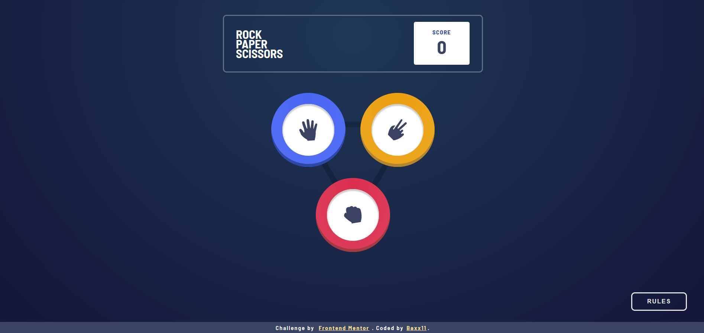

# Frontend Mentor - Rock, Paper, Scissors solution

This is a solution to the [Rock, Paper, Scissors challenge on Frontend Mentor](https://www.frontendmentor.io/challenges/rock-paper-scissors-game-pTgwgvgH). Frontend Mentor challenges help you improve your coding skills by building realistic projects. 

## Table of contents

- [Overview](#overview)
  - [The challenge](#the-challenge)
  - [Screenshot](#screenshot)
  - [Links](#links)
- [My process](#my-process)
  - [Built with](#built-with)
  - [What I learned](#what-i-learned)
  - [Continued development](#continued-development)
  - [Useful resources](#useful-resources)
- [Author](#author)
- [Acknowledgments](#acknowledgments)

## Overview

### The challenge

Users should be able to:

- View the optimal layout for the game depending on their device's screen size
- Play Rock, Paper, Scissors against the computer
- Maintain the state of the score after refreshing the browser _(optional)_

### Screenshot

### Links

- Solution URL: [Add solution URL here](https://your-solution-url.com)
- Live Site URL: [Add live site URL here](https://your-live-site-url.com)

## My process

### Built with

- Semantic HTML5 markup
- CSS custom properties
- Flexbox
- [Angular](hhttps://angular.io/) - JS library
- [angular-cli-ghpages](https://github.com/angular-schule/angular-cli-ghpages/#readme)

### What I learned

Animations have always been complicated for me, so this challenge helped me to a better understanding of animations with css

### Continued development

I want to improve my CSS animation skills because I think with these, the websites or apps we built can look more modern.

In the next project, I would like to use angular material for greater speed at the time of styling.

## Author

- Website - [Julian Cobos Bautista](https://baxx1199.github.io/portafolio/#about_us)
- Frontend Mentor - [@baxx1199](https://www.frontendmentor.io/profile/baxx1199)
